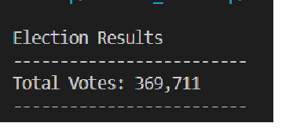

# 03-Election-Analysis

# Election_Analysis

## Overview of Election Audit
The purpose of election audit analysis is to leverage the election_results csv file and provide the following information and analysis results to the Board of election.
Using Python and  Visual studio code , the following election results are  gathered and presented to the board.
Total Number of Votes
Votes per County and their respective percentage
County that has the largest turnover
Individual Candiate votes and percentage
The election winner with their vote count and percentage

## Election-Audit Results

How many votes were cast in this congressional election?

Provide a breakdown of the number of votes and the percentage of total votes for each county in the precinct.

Which county had the largest number of votes?

Provide a breakdown of the number of votes and the percentage of the total votes each candidate received.

Which candidate won the election, what was their vote count, and what was their percentage of the total votes?

## Election-Audit Summary

The current script can be re used for other elections to calculate the winner and their vote percentage.Additionally we are also looking at the 
county that received the largest votes. These results over the years can be compared and analysed. We can make few modifications and split the candidate vote by county and then sum it up to get the total voting percentage.
